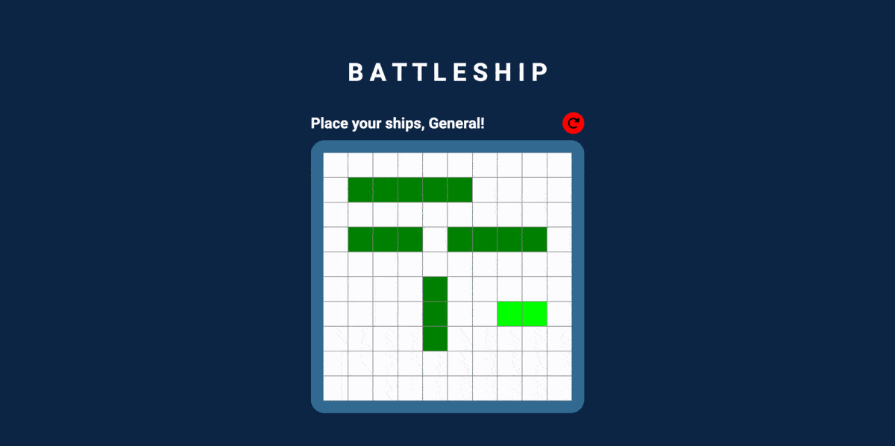

# Battleship
A single player battleship game where the player tries to sink all of the oponent's ships(implemented AI)  
[Live Demo](https://lemuellin.github.io/odin-battleship/) :point_left:



## Summary
1. Test Driven Development
    - Developed using Test-Driven-Development(TDD), unit tested game logic with Jest
2. Factories and Modules
    - Utilized OOP factory pattern to define gameboard objects and methods
3. Webpack
    - Compiled using Webpack for modular structure and project organization
4. Smart AI
    - Incorporated a computer AI by creating algorithms that allow it to make smart decisions

## Technologies
-   TDD: Test-Driven Development
-   Jest
-   Webpack
-   HTML5
-   CSS3
-   Vanilla Javascript

## Getting Started
##### Install and Run
```
git clone https://git@github.com:lemuellin/odin-battleship.git
cd odin-battleship
npm install
npm start
```
##### Test
```
npm test
```